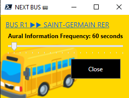
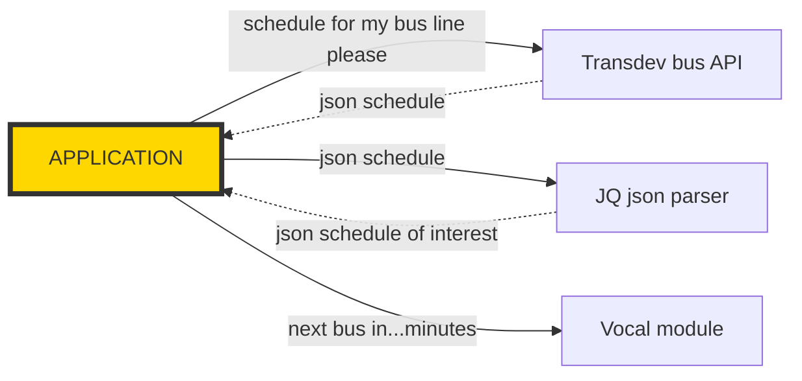

# BUSES SPEECH NOTIFIER

 SPEECH NOTIFICATION OF THE NEXT BUS SCHEDULED (powershell powered)

## INTRO 

Every morning my wife ask to me for the next buses to start its optimized morning run....Huuum this is a repetive task that can be automated with some lines of Powershell. We live in Paris (France) area and the bus service api requested is [Transdev-idf](https://www.transdev-idf.com/info-trafic) but its easy to convert it to another city or project, for example to notify about anything...a new commit...



## APPLICATION FLOWS



## TECH STACK

- Powershell Core 7.2.1 on Windows
    >https://github.com/PowerShell/PowerShell/releases

- [jq - A command-line JSON processor](https://stedolan.github.io/jq/)
    >chocolatey install jq
    
    >curl 'https://api.github.com/repos/stedolan/jq/commits?per_page=5' | jq '.[] | {message: .commit.message, name: .commit.committer.name}'
    
    >A jq playground to test jq syntax: [jqplay](https://jqplay.org/)

## USAGE

>PS>./r1_bus_notifier.ps1

>CMD>pwsh ./r1_bus_notifier.ps1

* With Task-Scheduler

```powershell
# Register the new PowerShell scheduled task

# The name of your scheduled task.
$taskName = "Bus_R1_Notifier"
# Describe the scheduled task.
$description = "Notify #R1 bus schedule"
$taskTrigger = New-ScheduledTaskTrigger -Weekly -DaysOfWeek Monday, Tuesday, Wednesday, Thursday, Friday -At "07:20AM"
$taskAction = New-ScheduledTaskAction `
    -Execute 'pwsh.exe' `
    -Argument "-File K:\tools\bus_notifier\r1_bus_notifier.ps1" -WorkingDirectory "K:\tools\bus_notifier"

# Register the scheduled task
Register-ScheduledTask `
    -TaskName $taskName `
    -Action $taskAction `
    -Trigger $taskTrigger `
    -Description $description
```

To test the scheduled task, you can either wait for the next run schedule or use the command below to manually trigger.
>Start-ScheduledTask -TaskName Bus_R1_Notifier

>Unregister-ScheduledTask -TaskName 'Bus_R1_Notifier' -Confirm:$false
```

### TECHNICAL DETAILS

You can find more details about the api used [here](technical_details.md)

## CONTRIBUTING

Wow, thanks to contribute to this project!   
New ideas, samples, forks...are welcome.  
So please just fork it, commit, push and send me a pull request to main.  

## CHANGELOG

See [CHANGELOG](CHANGELOG.md) for more details.

## LICENSE

This project is licensed under the [MIT License](LICENSE).

## ROADMAP

- ✔️ Make window nice
- ❌ Improve the speech
- ❌ Warn when service is unavailable.
- ❌ Detect shift in schedule from day to day and warn the user.
- ❌ Add connections to others transportation services (RER A for Paris area) to say 'connection with train x at 00h00 possible'.

### NOTES

Bus image comes from https://emojipedia.org/bus/

As jq for parsing Json, you can also try [htmlq](https://github.com/mgdm/htmlq), a jq but for HTML. Uses CSS selectors to extract bits of content from HTML files.

### DONATE

You can also contribute to the continued success of the project via donation. Please click this link.
