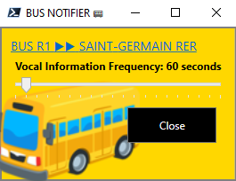

# BUSES SPEECH NOTIFIER

 SPEECH NOTIFICATION OF THE NEXT BUS SCHEDULED WITH POWERSHELL

## Intro 

Every morning my wife ask to me for the next buses to start its optimized morning run....Huuum this is a repetive task that can be automated with some lines of Powershell. We live in Paris (France) area and the bus service api requested is [Transdev-idf](https://www.transdev-idf.com/info-trafic) but its easy to convert it to another city or project, for example to notify about anything...a new commit...

## Application FLOWS

## Tech Stack

- Powershell Core 7.2.1 on Windows
    >https://github.com/PowerShell/PowerShell/releases

- [jq - A command-line JSON processor](https://stedolan.github.io/jq/)
    >chocolatey install jq
    
    >curl 'https://api.github.com/repos/stedolan/jq/commits?per_page=5' | jq '.[] | {message: .commit.message, name: .commit.committer.name}'
    
    >A jq playground to test jq syntax: [jqplay](https://jqplay.org/)

## Usage

>PS>./r1_bus_notifier.ps1

### API details

You can find more details about the api used [here](api_details.md)

### Contribute

You want to contribute to this project?   
Wow, thanks!   
New ideas, samples, forks...are welcome.  
So please just fork it, commit, push and send me a pull request to main.  

### Donate

You can also contribute to the continued success of the project via donation. Please click this link.

### Notes

Bus image comes from https://emojipedia.org/bus/

As jq for Json, you can also try [htmlq](https://github.com/mgdm/htmlq), a jq but for HTML. Uses CSS selectors to extract bits of content from HTML files.

## RoadMap

- ✔️ Make window nice
- ❌ Improve the speech
- ❌ Warn when service is unavailable.
- ❌ Detect shift in schedule from day to day and warn the user.
- ❌ Add connections to others transportation services (RER A for Paris area) to say 'connection with train x at 00h00 possible'.

### LICENSE

[MIT License](LICENSE)
